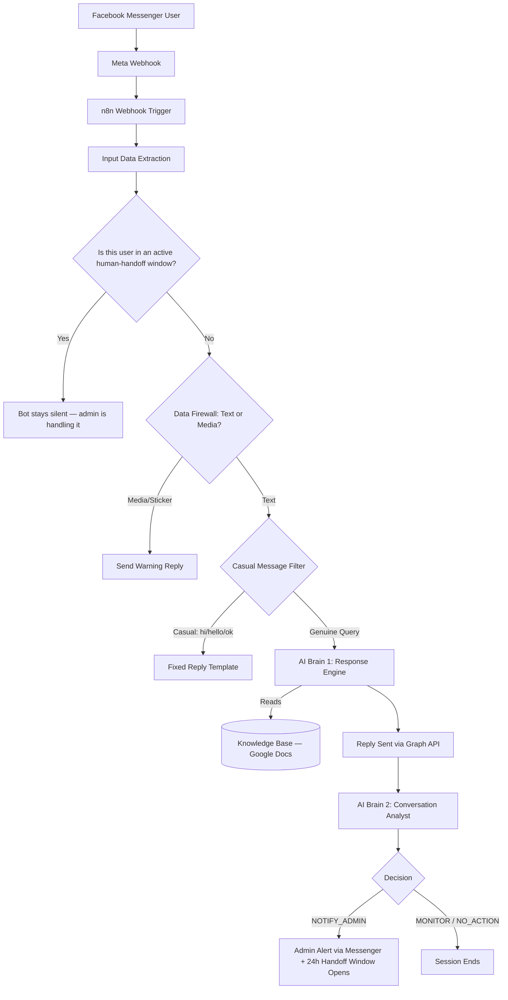

# AI-Powered Facebook Messenger Bot — n8n Automation System

**Production-grade, dual-AI Facebook Messenger automation built on n8n, Google Gemini, and Groq — handling real customer conversations end-to-end, escalating to a human when needed, and automatically resuming after handoff.**

> 📌 **This is a documentation / case-study repository.** It showcases the architecture, workflow design, and decision logic of a live AI Messenger bot through screenshots and technical write-up. Source code is not published — see [Why No Source Code](#why-no-source-code-is-public) below.

---

## Table of Contents

- [Overview](#overview)
- [The Problem It Solves](#the-problem-it-solves)
- [System Architecture](#system-architecture)
- [How It Works](#how-it-works)
- [Dual-AI Brain Architecture](#dual-ai-brain-architecture)
- [Human Handoff & Auto-Resume System](#human-handoff--auto-resume-system)
- [Tech Stack](#tech-stack)
- [Key Features](#key-features)
- [White-Label Deployment Model](#white-label-deployment-model)
- [Capacity & Results](#capacity--results)
- [FAQ](#faq)
- [Why No Source Code Is Public](#why-no-source-code-is-public)
- [Connect](#connect)

---

## Overview

This repository documents an **AI Messenger bot for Facebook Pages** — a production automation system that answers customer messages instantly, in the customer's own language, using a live knowledge base instead of scripted replies. It runs on a **28-node n8n workflow** with two separate AI agents working in sequence — one to reply, one to silently decide whether a human needs to step in — plus a built-in **human handoff system** that pauses the bot for a business owner to reply personally, then resumes automatically.

It was designed as a **white-label AI automation template** — one workflow, redeployable across multiple Facebook Business Pages by swapping only the knowledge base and business identity.

**Core keywords:** AI Messenger bot, n8n workflow automation, Facebook Graph API chatbot, Gemini AI agent, Groq Llama fallback, conversational AI for business, customer service automation, AI human handoff chatbot, lead detection AI, Messenger automation Bangladesh, AI automation agency Bangladesh.

## The Problem It Solves

Small and medium businesses lose leads every day because nobody is online to reply outside business hours. A customer who messages at 3 AM and gets silence usually doesn't come back. This system closes that gap:

- Instant, accurate replies — 24/7, no human on standby
- Replies pulled from real business data (Google Docs knowledge base), not hardcoded FAQ scripts
- Automatic language detection (Bangla / English) with no manual configuration
- Serious inquiries are flagged and escalated to a human — casual messages are not
- When a human does step in, the AI steps back automatically instead of talking over them

## System Architecture

📸 *Full n8n canvas screenshot:*

`assets/screenshots/workflow-overview.png`

*(Replace this file with your own exported workflow screenshot — see [assets/screenshots](assets/screenshots))*

## How It Works

1. **Webhook receives** the incoming Messenger event from Meta's Graph API
2. **Data extraction** pulls `user_message`, `sender_id`, `recipient_id`, and `page_id`
3. **Handoff check** looks up whether this user is currently inside an active human-handoff window — if so, the bot stays silent so the admin can reply personally without interference
4. **Data firewall** filters out non-text input (images, stickers, voice notes) with a polite fallback message
5. **Casual-message filter** short-circuits greetings (`hi`, `hello`, `হাই`, `ok`) into a fixed branded reply — saving AI quota for real queries
6. **AI Brain 1** (Gemini 2.5 Flash, with Groq Llama 3.3 70B as automatic fallback) reads the knowledge base and generates a contextual, language-matched reply, appending an invisible routing tag
7. **Reply is sent** to the user instantly via the Graph API
8. **AI Brain 2** re-reads the full session and independently decides: `NOTIFY_ADMIN`, `MONITOR`, or `NO_ACTION`
9. **Admin is notified on Messenger** only when a decision genuinely warrants it — not for every message
10. **Handoff window opens automatically** for 24 hours, during which the bot pauses for that user; if the admin doesn't reply in time, the bot resumes the conversation on its own

## Dual-AI Brain Architecture

The core design decision behind this system: **one AI model should not both talk to the customer and judge the conversation.** Splitting those responsibilities into two agents removes bias and keeps notifications meaningful.

| | AI Brain 1 — Response Engine | AI Brain 2 — Conversation Analyst |
|---|---|---|
| **Job** | Generate the customer-facing reply | Decide if a human needs to intervene |
| **Input** | User message + Knowledge Base | Full session history + latest reply |
| **Output** | Natural-language reply + hidden tag | Structured JSON decision |
| **Runs** | Once per message | Once per message, after the reply is sent |
| **Visible to user** | Yes | No — fully silent |

This separation means the customer never sees a robotic "let me connect you to a human" fallback — the analyst layer handles that decision quietly in the background.

## Human Handoff & Auto-Resume System

A dedicated subsystem tracks, per user, whether a human admin is currently expected to be handling the conversation:

- When AI Brain 2 decides `NOTIFY_ADMIN`, the admin gets a Messenger alert **with a clear 24-hour reply deadline**, and the user gets an automatic confirmation that their message has been forwarded to a human
- For the next 24 hours, the AI bot goes quiet for that specific user — so the admin's manual reply is never talked over or duplicated by the AI
- If the admin doesn't respond within the window, the AI **automatically resumes** the conversation, so no customer is ever left waiting indefinitely because of a missed notification

This turns the bot from a simple auto-responder into a proper **AI + human hybrid support system**, where the AI covers the busy hours and quietly gets out of the way the moment a person takes over.

## Tech Stack

| Layer | Technology |
|---|---|
| Automation Engine | [n8n](https://n8n.io) (self-hosted) |
| Messaging Platform | Meta Facebook Graph API v25.0 |
| Primary AI Model | Google Gemini 2.5 Flash |
| Fallback AI Model | Groq — Llama 3.3 70B |
| Knowledge Base | Google Docs (structured, AI-readable) |
| Handoff State Tracking | Google Sheets |
| Hosting | AWS EC2 (Ubuntu 22.04) |
| Reverse Proxy / SSL | Nginx + Let's Encrypt (Certbot) |

## Key Features

- 🌐 Automatic bilingual language detection (Bangla / English) — no manual switch
- 🧠 Live knowledge-base retrieval instead of static/hardcoded replies
- 🏷️ Hidden intent tagging system (`[LEAD_DETECTED]`, `[ADMIN_NEEDED]`, `[OFF_TOPIC]`) invisible to the end user
- 🤝 Human handoff with automatic 24-hour auto-resume — the AI never talks over a human agent
- 🔁 Automatic AI model fallback — the bot never goes silent if one provider rate-limits
- 🧵 Per-user session memory for context-aware replies
- 🔔 Smart, de-duplicated admin notifications with a built-in reply deadline
- 🧱 Media/sticker firewall with a graceful fallback response
- 💸 $0/month infrastructure cost using free-tier services throughout

## White-Label Deployment Model

This workflow was built to be **redeployed for new clients** by changing only a handful of things:

| Changes per client | Stays identical |
|---|---|
| Knowledge Base document | Full n8n workflow (28 nodes) |
| Fixed reply templates & branding | AI Brain 1 & Brain 2 prompt logic |
| Page Access Token | Message filtering & routing rules |
| Admin Messenger recipient ID | Human handoff / auto-resume logic |
| Handoff-tracking sheet (own copy per client) | — |

## Capacity & Results

- **Rate limit headroom:** thousands of AI requests/day combined (Gemini + Groq free tiers), comfortably covering typical small-business Messenger volume
- **Response latency:** sub-5-second reply time from message receipt to delivery
- **Operating cost:** $0/month (fully within free-tier limits across all services)
- **Live status:** actively developed and tested against real-world conversation scenarios ahead of full production rollout on a business Facebook Page

## FAQ

**What AI models power this Messenger bot?**
Google Gemini 2.5 Flash is the primary model, with Groq's Llama 3.3 70B running as an automatic fallback so replies never stop if one provider is rate-limited.

**How does the bot decide when to escalate to a human?**
A second AI agent ("AI Brain 2") reads the full conversation after every exchange and outputs a structured decision — `NOTIFY_ADMIN`, `MONITOR`, or `NO_ACTION` — independently of the reply-generating agent.

**What happens after the bot escalates to a human?**
The admin gets a Messenger alert with a 24-hour reply deadline, and the AI automatically pauses for that user so it doesn't talk over the human agent. If the admin doesn't reply within 24 hours, the AI automatically resumes the conversation.

**What automation platform is this built on?**
[n8n](https://n8n.io), a self-hosted workflow automation engine, using a 28-node pipeline connected to the Meta Facebook Graph API, Google Gemini, Groq, Google Docs, and Google Sheets.

**Can this system be adapted for other businesses or Facebook Pages?**
Yes — it was designed as a white-label template. Only the knowledge base, branding, and admin contact change; the workflow, AI prompts, and routing logic stay the same.

**Does this bot support languages other than English?**
Yes. It auto-detects the customer's language (currently Bangla and English) per message and replies in kind, without any manual configuration.

**Is this a chatbot builder / SaaS product?**
No — this is a custom-built automation system deployed for a specific business, documented here as a technical case study.

## Why No Source Code Is Public

This repository intentionally contains **no workflow export or source code**. The n8n workflow, system prompts, and knowledge base structure were built as commercial, client-deployable IP for [AutomateIQ Labs](https://www.facebook.com/automateiq.labs/), and are not open-sourced. What you'll find here is the architecture, decision logic, and a screenshot of the live system for portfolio and case-study purposes.

If you're a business owner or agency interested in a similar AI Messenger automation system for your own Facebook Page — with human handoff built in — reach out via the contact details below.

## Connect

**Muhammad Antor** — AI Automation Builder, Bangladesh 🇧🇩

- LinkedIn: [linkedin.com/in/muhammad-antor](https://www.linkedin.com/in/muhammad-antor)
- Facebook (AutomateIQ Labs): [facebook.com/automateiq.labs](https://www.facebook.com/automateiq.labs/)
- Instagram: [instagram.com/automateiq.labs](https://www.instagram.com/automateiq.labs/)
- GitHub: [github.com/muhammadantor](https://github.com/muhammadantor)

---

Documentation repository by AutomateIQ Labs — "Automate Smarter with AI". Screenshots and architecture shared for portfolio purposes; underlying implementation is proprietary client work.
