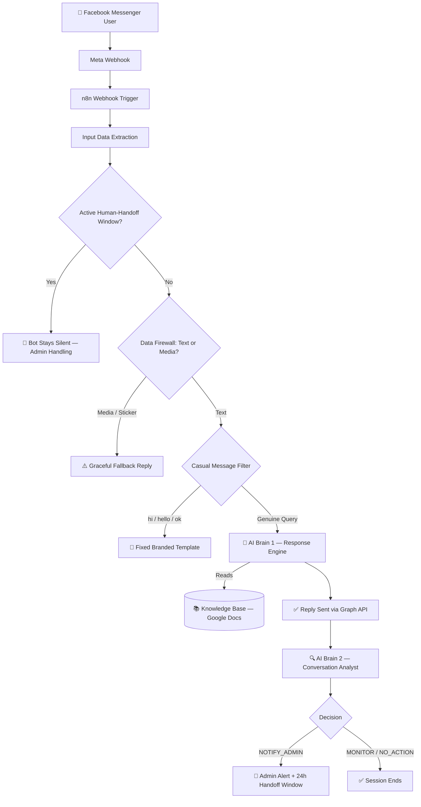

<!-- 
SEO Keywords: n8n Facebook Messenger bot, AI chatbot n8n workflow, Facebook page automation, 
Gemini AI Messenger bot, Groq chatbot, AI customer support automation, human handoff chatbot,
n8n workflow automation Bangladesh, Facebook Graph API bot, bilingual chatbot Bangla English,
AI agent n8n, conversational AI business, AutomateIQ Labs, messenger automation n8n
-->

<div align="center">


[](https://n8n.io)
[](https://ai.google.dev)
[](https://groq.com)
[](https://developers.facebook.com/docs/messenger-platform)
[]()
[]()
[](https://www.facebook.com/automateiq.labs/)

<br/>

[](https://git.io/typing-svg)

<br/>

> **A production-grade, dual-AI Facebook Messenger automation built on self-hosted n8n — handling real customer conversations 24/7, escalating to a human when needed, and automatically resuming after handoff.**

</div>

---

## 🎬 Watch It in Action

> See the live AI Messenger bot handling real customer conversations.

<div align="center">

| Video | Description | Watch |
|:---:|:---:|:---:|
| 🔴 **Live Demo** | Real customer messages — bot replies in real time | [▶ Watch Live](https://www.facebook.com/share/v/197bCWF631/) |
| 🧠 **Full System Explanation** | Complete guide — architecture, workflow, how it works | [▶ Watch Overview](https://www.facebook.com/share/v/1Czv3gtbWv/) |

</div>

---

## 📌 What Is This?

**AI Facebook Messenger Bot** is a fully automated, production-ready customer support system for Facebook Business Pages. Built on **self-hosted n8n** with a **28-node workflow**, it uses two AI agents working in sequence to reply to customers, detect escalation needs, and hand off to a human — automatically.

**No scripts. No hardcoded replies. Just AI reading your live business knowledge base and responding like a human.**

Built by **[Muhammad Antor](https://www.linkedin.com/in/muhammad-antor)** | [AutomateIQ Labs](https://www.facebook.com/automateiq.labs/) 🇧🇩

---

## ❓ The Problem It Solves

Businesses lose customers every day because **no one is online to reply at 3 AM**.

A customer who messages and gets silence usually doesn't come back.

This system closes that gap permanently:

- ⚡ Instant, accurate replies — **24/7**, no human on standby
- 📚 Replies from **live business data** (Google Docs KB) — not hardcoded FAQ scripts
- 🌐 **Auto language detection** — Bangla or English, per message, zero manual setup
- 🚨 **Smart escalation** — serious inquiries flagged to human; casual messages handled alone
- 🤝 **Human handoff** — when admin takes over, AI steps back automatically
- 🔁 **Auto-resume** — if admin doesn't reply within 24h, AI picks the conversation back up

---

## 🏗️ System Architecture

### High-Level Flow


```mermaid
flowchart TD
    A[📱 Facebook Messenger User] --> B[Meta Webhook]
    B --> C[n8n Webhook Trigger]
    C --> D[Input Data Extraction]
    D --> E{Active Human-Handoff Window?}
    E -->|Yes| P[🤫 Bot Stays Silent — Admin Handling]
    E -->|No| F{Data Firewall: Text or Media?}
    F -->|Media / Sticker| G[⚠️ Graceful Fallback Reply]
    F -->|Text| H{Casual Message Filter}
    H -->|hi / hello / ok| I[📝 Fixed Branded Template]
    H -->|Genuine Query| J[🧠 AI Brain 1 — Response Engine]
    J -->|Reads| K[(📚 Knowledge Base — Google Docs)]
    J --> L[✅ Reply Sent via Graph API]
    L --> M[🔍 AI Brain 2 — Conversation Analyst]
    M --> N{Decision}
    N -->|NOTIFY_ADMIN| O[🔔 Admin Alert + 24h Handoff Window]
    N -->|MONITOR / NO_ACTION| Q[✅ Session Ends]
```

### Architecture Overview

| Layer | What Happens |
|---|---|
| **Input** | Meta webhook fires on every Messenger event |
| **Handoff Check** | Is this user in an active human session? → Bot pauses if yes |
| **Data Firewall** | Non-text (images, stickers, voice) → polite fallback |
| **Casual Filter** | Greetings short-circuit to a fixed template, saving AI quota |
| **AI Brain 1** | Gemini reads KB → generates reply → sends to user via Graph API |
| **AI Brain 2** | Reads full session → outputs JSON decision: NOTIFY / MONITOR / NO_ACTION |
| **Admin Alert** | Messenger notification + 24h handoff window opens |
| **Auto-Resume** | If admin doesn't reply in 24h → AI resumes automatically |

**Total: 28 nodes · 2 AI agents · 1 self-hosted n8n instance**

---

## 🧠 Dual-AI Brain Architecture

The core design decision: **one AI should not both talk to customers AND judge the conversation.**

Splitting into two agents removes bias and keeps admin notifications meaningful — not noisy.

| | 🧠 AI Brain 1 — Response Engine | 🔍 AI Brain 2 — Conversation Analyst |
|---|---|---|
| **Job** | Generate the customer-facing reply | Decide if a human needs to intervene |
| **Input** | User message + Knowledge Base | Full session history + latest reply |
| **Output** | Natural-language reply + hidden intent tag | Structured JSON decision |
| **Runs** | Once per message | Once per message, after reply is sent |
| **Visible to user** | ✅ Yes | ❌ No — fully silent |
| **Model** | Gemini 2.5 Flash (primary) | Groq Llama 3.3 70B (fallback) |

> Hidden intent tags like `[LEAD_DETECTED]`, `[ADMIN_NEEDED]`, `[OFF_TOPIC]` are embedded in replies — invisible to the customer, readable by AI Brain 2.

---

## 🤝 Human Handoff & Auto-Resume System

```
Customer sends urgent / frustrated message
        ↓
AI Brain 2 → NOTIFY_ADMIN
        ↓
Admin gets Messenger alert with 24h deadline
        ↓
AI goes SILENT for this specific user
        ↓
Admin replies manually → customer gets personal response
        ↓
24h window expires → AI AUTOMATICALLY RESUMES
(or admin doesn't reply → AI picks it up anyway)
```

This turns the bot from a simple auto-responder into a **true AI + human hybrid support system** — the AI handles volume, humans handle relationships.

---

## ⭐ Key Features

| Feature | Detail |
|---|---|
| 🌐 **Bilingual Auto-Detection** | Detects Bangla or English per message — replies in the same language |
| 📚 **Live Knowledge Base** | Reads from Google Docs in real time — update your KB, bot replies change instantly |
| 🏷️ **Hidden Intent Tagging** | `[LEAD_DETECTED]` `[ADMIN_NEEDED]` `[OFF_TOPIC]` — invisible routing signals |
| 🤝 **Human Handoff** | Admin takes over → AI steps back silently for 24h |
| 🔁 **Auto-Resume** | 24h deadline passed with no admin reply → AI picks conversation back up |
| 🔔 **Smart Notifications** | Admin alerted only when it genuinely matters — no alert spam |
| 🛡️ **Media Firewall** | Images, stickers, voice notes → graceful fallback reply |
| ⚡ **Casual Message Filter** | `hi` / `hello` / `হাই` → fixed template, zero AI cost |
| 🔄 **AI Fallback** | Gemini rate-limited? Groq takes over instantly — bot never goes silent |
| 🧵 **Session Memory** | Per-user context for coherent multi-turn conversations |
| 💰 **$0/month** | Runs entirely on free tiers — Gemini + Groq + Sheets + Docs |
| 🏠 **Self-Hosted** | Your data never leaves your infrastructure |

---

## 🛠️ Tech Stack

| Layer | Technology |
|---|---|
| ⚙️ Automation Engine | [n8n](https://n8n.io) — self-hosted, Docker |
| 💬 Messaging Platform | Meta Facebook Graph API v25.0 |
| 🧠 Primary AI | Google Gemini 2.5 Flash |
| 🔁 Fallback AI | Groq — Llama 3.3 70B |
| 📚 Knowledge Base | Google Docs (structured, AI-readable) |
| 📊 Handoff Tracking | Google Sheets |
| ☁️ Server Hosting | AWS EC2 (Ubuntu 22.04) |
| 🔐 SSL / Reverse Proxy | Nginx + Let's Encrypt (Certbot) |

---

## 📦 White-Label Deployment Model

This workflow was designed to be **redeployed for multiple clients** by changing only a handful of values:

| Changes Per Client | Stays Identical |
|---|---|
| Knowledge Base document | Full 28-node n8n workflow |
| Fixed reply templates & branding | AI Brain 1 & 2 logic |
| Page Access Token | Message filtering & routing |
| Admin Messenger recipient ID | Human handoff / auto-resume system |
| Handoff-tracking Sheet | — |

**One workflow → infinite deployments.** This is the foundation of [AutomateIQ Labs](https://www.facebook.com/automateiq.labs/)' white-label AI automation service.

---

## 📊 Capacity & Performance

| Metric | Result |
|---|---|
| 💬 Response latency | Sub-5 seconds from message receipt to delivery |
| 🔁 AI requests/day | Thousands — well within Gemini + Groq free tier combined |
| 💰 Monthly operating cost | **$0** — fully within free-tier limits |
| 🌐 Languages supported | Bangla + English (auto-detected per message) |
| 📋 Workflow nodes | 28 nodes across 7 layers |
| ✅ Live status | Production — tested against real-world conversation scenarios |

---

## 🔒 Why No Source Code Is Public

> 📌 **This is a documentation / case-study repository.**

The n8n workflow JSON, AI system prompts, and knowledge base structure are **proprietary commercial IP** of [AutomateIQ Labs](https://www.facebook.com/automateiq.labs/). They are not open-sourced.

What you'll find here:
- ✅ Full system architecture & decision logic
- ✅ Live demo videos
- ✅ Tech stack & performance data
- ✅ White-label deployment model
- ❌ Workflow JSON export
- ❌ AI system prompts

If you're a business owner or agency interested in this AI Messenger automation system for your own Facebook Page, [reach out below](#-connect).

---

## ❓ FAQ

**What AI models power this bot?**
Google Gemini 2.5 Flash (primary) with Groq Llama 3.3 70B as automatic fallback — so the bot never goes silent if one provider rate-limits.

**How does the bot decide when to escalate?**
A second AI agent (Brain 2) reads the full conversation after every exchange and outputs a structured JSON decision — `NOTIFY_ADMIN`, `MONITOR`, or `NO_ACTION` — independently of the reply agent.

**What happens after escalation?**
Admin gets a Messenger alert with a 24-hour deadline. The AI pauses for that user. If the admin doesn't reply within 24h, the AI automatically resumes.

**Can this be adapted for other businesses?**
Yes — white-label template. Only the knowledge base, branding, and admin contact change. The workflow and AI logic stay the same.

**Does it support languages other than English?**
Yes — auto-detects Bangla and English per message, replies in the customer's language with zero manual configuration.

**What automation platform is this built on?**
[n8n](https://n8n.io), self-hosted via Docker on AWS EC2, using a 28-node pipeline connected to Meta Graph API, Gemini, Groq, Google Docs, and Google Sheets.

---

## 🤝 Connect

**Interested in a custom AI Messenger Bot for your Facebook Page?**

**Muhammad Antor** — AI Automation Engineer | Founder, AutomateIQ Labs 🇧🇩

[](https://www.linkedin.com/in/muhammad-antor)
[](https://www.facebook.com/automateiq.labs/)
[](https://www.instagram.com/automateiq.labs/)
[](mailto:muhammadantor71@gmail.com)
[](https://github.com/muhammadantor)

---

<div align="center">

*Built with ❤️ by [AutomateIQ Labs](https://www.facebook.com/automateiq.labs/) · Bangladesh*

*"Automate Smarter with AI"*


</div>

<!--
SEO Keywords: n8n Facebook Messenger bot, AI chatbot n8n, Facebook page automation n8n,
Gemini AI chatbot, Groq Llama chatbot, AI customer support bot, human handoff chatbot n8n,
Facebook Graph API automation, bilingual chatbot Bangla English, n8n AI agent workflow,
messenger bot automation Bangladesh, AutomateIQ Labs, conversational AI n8n,
white-label chatbot automation, AI messenger automation freelancer Bangladesh
-->
